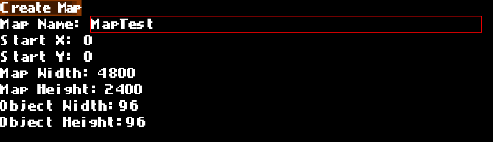

# CEngine

This project contains a simple 2D game scene developed using the CEngine. CEngine is a custom game engine built with LWJGL (Lightweight Java Game Library) and OpenGL, providing optimized graphics and resource management.

  
## Features

- **Custom Game Engine**: Built from scratch, allowing full control over graphics and resource handling.
- **2D Rendering**: Efficient 2D sprite rendering using batching techniques.
- **Physics Engine**: Integration with JPhysics library for handling object physics.
- **Animation System**: Play character animations depending on actions like jumping, falling, and running. (has many problems)

## Requirements

- **Java**: Java 8 or higher
- **JavaFX** (for console)
- **LWJGL**: Version 3.x or higher
- **OpenGL**: Modern OpenGL context for rendering

## How To Clone and Test
1. Open the project as maven project on your IDE.
2. and run the Starter.java class for testing the engine. If you can open the test game and run it then there should be no problem.

## How to Start
1.create your main game class. you can implement HasLogger to let engine use your logger to log important things.
```java
public class MainGame implements CEComponent, HasLogger {
    @Override
    public void init() {
        
    }

    @Override
    public void loop() {

    }

    @Override
    public void dispose() {

    }

    @Override
    public CLogger getLogger() {
        return CLoggerSystem.logger(this.getClass());
    }
}
```
2. add your component to engine before running and run.
```java
   public class Starter {
   public static void main(String[] args) {
   CEngine.setParentPublicComponent(new MainGame());
   CEngine.ENGINE.run();
   }
   }
```
3. create the scene class
```java
public class MainGameScene1 extends CEScene {
    @Override
    public void init() {
        super.init();
    }
    @Override
    public void update(double dt) {
        super.update(dt);
    }

    @Override
    public String getName() {
        return "Scene_1";
    }
}


```

4. set scene
```java
public class MainGame implements CEComponent, HasLogger {
    @Override
    public void init() {
        CEngine.SCENE.setScene(new MainGameScene1());
    }

    @Override
    public void loop() {

    }

    @Override
    public void dispose() {

    }

    @Override
    public CLogger getLogger() {
        return CLoggerSystem.logger(this.getClass());
    }
}
```
5. see the example in the io.github.cakilgan.game package.
## C2DMap Editor
 #### C2DMap
C2DMap is a class for implementing easy maps for games.
Normally you must do it all the job yourself by creating a map file and manually writing.
an example .c2dmap file.
```
//50,25
constructor {
   0,0,snakeGameScene
}
init {
 960,960,48,48
}
addSpriteSheet {
tileset src/main/resources/game/assets/snakegame/atlas.png 170 170,
}
addSprite {
}
setSprite {
}
setZPos {
all 400 -100
}
addPointer {
4 tileset[33] ,
5 tileset[21],
6 tileset[22],
7 tileset[23],
8 tileset[26],
9 tileset[25],
a tileset[24],
b tileset[31],
c tileset[32]
}
parseMap {
5bbbbbbbbbbbbbbbbbb8
64444444444444444449
64444444444444444449
64444444444444444449
64444444444444444449
64444444444444444449
64444444444444444449
64444444444444444449
64444444444444444449
64444444444444444449
64444444444444444449
64444444444444444449
64444444444444444449
64444444444444444449
64444444444444444449
64444444444444444449
64444444444444444449
64444444444444444449
64444444444444444449
7cccccccccccccccccca
}
```
with this file engine creates a map 960 width 960 height with 48x48 objects and uses the tileset of desired path. Pointers registered in addPointer method. And used in parseMap method.

I think this is a bothersome job so i created a editor for this.

red box shows that what textarea you are you can move by up and down arrows.

when you click the create map button 

1. in the map red box shows the tile you are in.
2. choose the sprite you want to use on the left and click on map to paste.
3. if you press ctrl+left-click on the sprite you want, all the map will fill with it. 
4. when you are all done press enter to save the mapFile.
## Games
 ### SnakeGame
 
 
 - Use arrow keys to play.
 - Press enter the try again when you lost.
 - Shows the fps,move ms,score
 - It stores high score in highscore.dat and loads from there when game is restarted.
## To-Do

- Add more game examples.
- Implement sound management.
- Improve physics performance.
- Improve Animation System and fix the delay issue.

